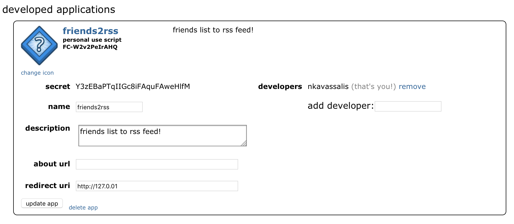

# friends2rss

This is a quick 30 minute hack of a script to generate an RSS feed from your reddit friends list. I've been trying to spend less time on Reddit and still keep track of what a couple interesting people do. Reddit generates RSS for most URLs (http://reddit.com/url/.rss) but the friends list requires authentication to access. While following specific subreddits often works for me, it doesn't let me isolate the posts from specific people. This script uses the API's oAuth authentication and converts a JSON blob to a very hand made RSS feed. This could probably be cleaned up a lot but it seems to work well enough for me!

You could easily customize this to generate an RSS feed from a different Reddit URL (authenticated or otherwise) - as well as customize what gets put into the RSS feed. The API does spit out iframes for sites like imgur and other 'friendly' pages. Some RSS readers accept them (i.e. Reeder 3 on OSX), others do not (i.e. Reeder on iOS) and it technically violates the spec. Buncha potential for interesting things though.

Requires Python 2.7 with the requests and json packages. Tested on Python 2.7.10 Amazon Linux and Python 2.7.11 OSX. YMMV

I personally cron it on a webserver to run every 15 minutes `*/15 * * * * python /path/to/friends2rss.py > /some/web/path/myfriends.rss` and point my reader to the live URL. You could also run it live via CGI.

To use this you'll need to create an app on Reddit. Go to https://www.reddit.com/prefs/apps/ and create an app. Give it any name, chose "script" as type and enter http://127.0.0.1 as the redirect url (it's unused). See the below screenshot for an example (note this isn't a real application and its client id and secret will not work for you)

Before using the script, fill in the four variables at the top. Your app's client id and its secret from above, aswell as your reddit user and password. It makes an oAuth request on every run.

`clientid = ""`

`secret = ""`

`reddituser = ""`

`redditpass = ""`

Happy (less) Redditing.
